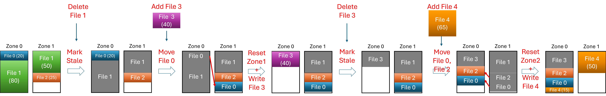
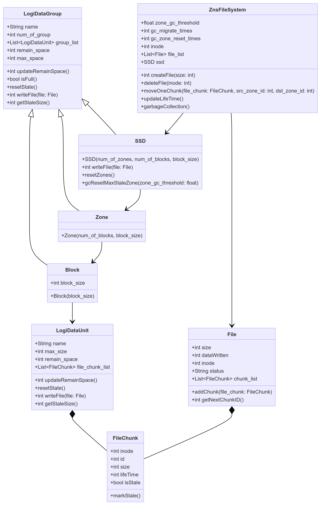

# PyZnsSim - A Simple Zoned Namespaces (ZNS) Simulator

PyZnsSim is an advanced ZNS simulator designed to enable users to configure various parameters such as the number of zones, blocks, and block sizes. It facilitates the calculation of file distribution across storage units.

## Getting Started

Suppose we have a simple ZNS SSD with 2 zones, 1 block per zone, and 100 bytes per block. We can create an instance ``zns_fs``
```Python
from zns_sim import ZnsFileSystem

# Create a ZNS with 1 zones, 1 blocs per zone, and 100 bytes per block
zns_fs = ZnsFileSystem(num_of_zones=2, num_of_blocks=1, block_size=100)
```

Now let's write 3 files into the disk (File 0: 20 bytes, File 1: 130 bytes, File 2: 25 bytes)
```Python
zns_fs.createFile(20)
zns_fs.createFile(130)
zns_fs.createFile(25)
```
the output will be
```console
File 0 (size: 20) is created.
File 1 (size: 130) is created.
File 2 (size: 25) is created.
```
We can print the file chunks inside the Zone's blocks
```Python
zns_fs.printSSD()
```
the outputs are
```
SSD 0:
Zone 0:
Block 0:
iNode: 0, Chunk 0: size 20, isStale False, life 0
iNode: 1, Chunk 0: size 80, isStale False, life 0
Zone 1:
Block 0:
iNode: 1, Chunk 1: size 50, isStale False, life 0
iNode: 2, Chunk 0: size 25, isStale False, life 0
```

Because our disk only has a capacity of 200 bytes, and we have written 175 bytes. Let's delete File 1 to free some space
```Python
zns_fs.deleteFile(1)
```
the output will be
```console
File 1's chunks are marked stale.
```

As you can see, the delete operation only mark the chunks of File 1 as staled. We need to run garbage collection to actually erase the data
```Python
zns_fs.garbageCollection()
```
The default garbage collection method is Max-Stale greedy, which finds the Zone with max staled data, copy the file chunks alive to other zones, and reset it. The process will be printed as below
```console
Chunk ( 0 , 0 ) in zone  0  is moved to zone 1
Zone 0 is reset.
Garbage collection done.
```

We continue to write new File 3 (40 bytes), collect garbage, and write File 4 (65 bytes)
```Python
zns_fs.createFile(40)
zns_fs.garbageCollection()
zns_fs.createFile(65)
```
Let's look at the final file chunk distribution in our SSD using `zns_fs_printSSD()`, the outputs are
```console
SSD 0:
Zone 0:
Block 0:
iNode: 3, Chunk 0: size 40, isStale False, life 0
iNode: 2, Chunk 0: size 25, isStale False, life 1
iNode: 0, Chunk 0: size 20, isStale False, life 1
iNode: 4, Chunk 0: size 15, isStale False, life 0
Zone 1:
Block 0:
iNode: 4, Chunk 1: size 50, isStale False, life 0
```
Our test case above can be visualzed in the figure below



## System Architecture

The UML diagram of PyZnsSim is shown in the figure below. The core class is ``LogiDataGroup``. class ``SSD``, ``Zones``, ``Blocks`` are all inherited from ``LogiDataGroup``. Another important class is ``FileChunks``, which represents the data save on each logical storge unit.


